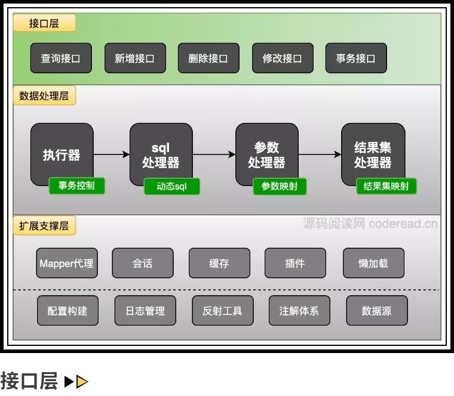
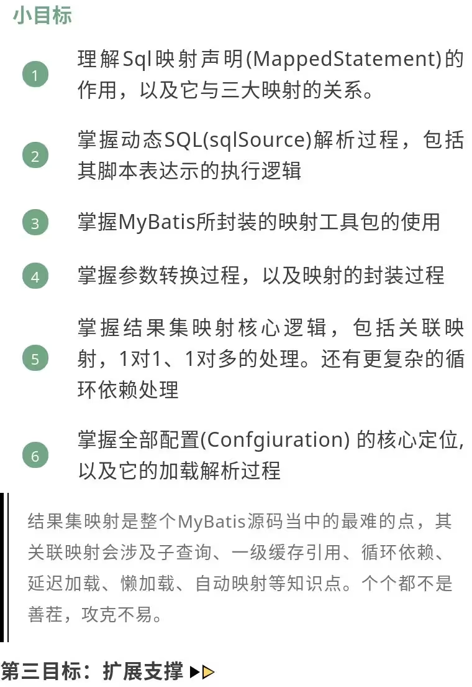
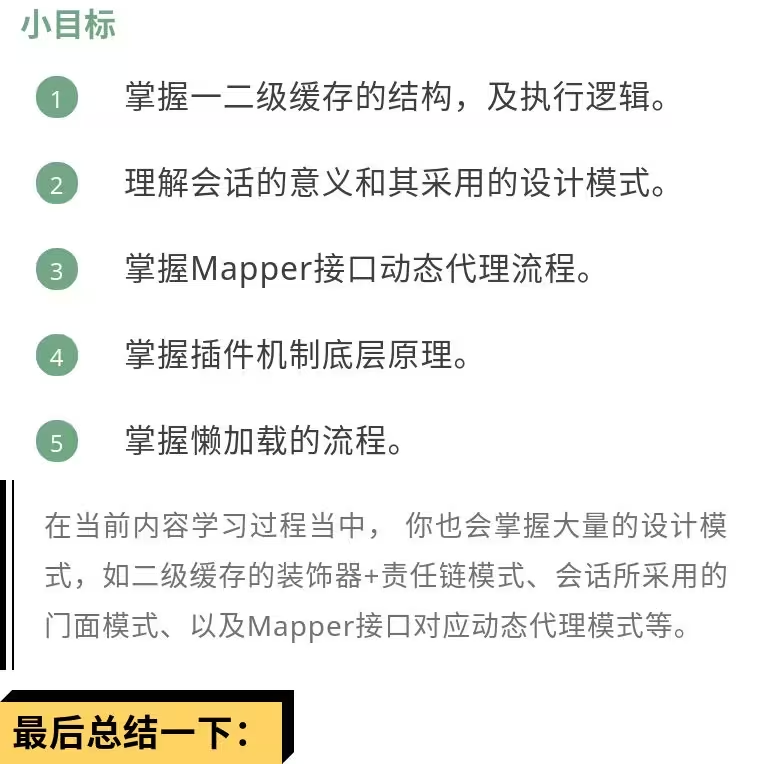

### 基础组件

### java.sql

#### PreparedStatement

`PreparedStatement` 是 JDBC 中一个强大而安全的接口，通过预编译 SQL 语句和使用占位符来设置参数，可以提高性能并防止 SQL 注入攻击。

##### 1. 预编译和缓存

`PreparedStatement` 对象代表一个预编译的 SQL 语句。预编译的好处是 SQL 语句只需要编译一次，而不需要每次执行时都重新编译。这对于频繁执行相同 SQL 语句的场景可以显著提高性能。

##### 2. 防止 SQL 注入

使用 `PreparedStatement` 可以有效防止 SQL 注入攻击。因为它使用占位符 (`?`) 来表示参数，而不是直接将用户输入拼接到 SQL 语句中，这样可以避免恶意用户通过特殊字符来篡改 SQL 语句。

##### 3. 设置参数

在 `PreparedStatement` 中，可以使用各种 `set` 方法来设置参数（如 `setInt`、`setString` 等）。这些方法会将参数值绑定到 SQL 语句中的对应占位符上。

##### 4. 执行 SQL 语句

`PreparedStatement` 可以执行各种类型的 SQL 语句，包括查询（`executeQuery`）、更新（`executeUpdate`）和任意 SQL 语句（`execute`）。

##### 示例代码

以下是一个使用 `PreparedStatement` 的简单示例：

```java
import java.sql.Connection;
import java.sql.DriverManager;
import java.sql.PreparedStatement;
import java.sql.ResultSet;
import java.sql.SQLException;

public class PreparedStatementExample {
    public static void main(String[] args) {
        String url = "jdbc:mysql://localhost:3306/mydatabase";
        String user = "username";
        String password = "password";
        
        try (Connection conn = DriverManager.getConnection(url, user, password)) {
            String sql = "SELECT * FROM users WHERE username = ?";
            PreparedStatement pstmt = conn.prepareStatement(sql);
            // 1 表示 set 的是第几个 ? 的参数
            pstmt.setString(1, "john_doe");
            
            ResultSet rs = pstmt.executeQuery();
            
            while (rs.next()) {
                System.out.println("User ID: " + rs.getInt("id"));
                System.out.println("Username: " + rs.getString("username"));
                System.out.println("Email: " + rs.getString("email"));
            }
            
        } catch (SQLException e) {
            e.printStackTrace();
        }
    }
}
```

在这个示例中：

1. 建立数据库连接。
2. 创建 `PreparedStatement` 对象，并在 SQL 语句中使用占位符 (`?`)。
3. 使用 `setString` 方法设置参数值。
4. 执行查询并处理结果集。

### Debug logger

#### Log

`org.apache.ibatis.logging.Log` 是 MyBatis 框架中的一个接口，用于抽象和实现日志记录功能。接口定义了日志记录的基本方法，这些方法通常包括以下几种：

- `void error(String s, Throwable e);` 和 `void error(String s);`：用于记录错误信息。前者允许记录异常堆栈信息，后者只记录错误消息。
- `void warn(String s);`：用于记录警告信息。
- `void debug(String s);`：用于记录调试信息。
- `void info(String s);`：用于记录一般信息。
- `boolean isDebugEnabled();`：用于检查是否启用了调试级别的日志记录。
- `boolean isTraceEnabled();`：用于检查是否启用了跟踪级别的日志记录。

##### 策略模式

MyBatis 支持多种日志框架，通过不同的实现类来适配这些框架。常见的实现类包括：

- `org.apache.ibatis.logging.slf4j.Slf4jImpl`：使用 SLF4J 作为日志框架。
- `org.apache.ibatis.logging.log4j2.Log4j2Impl`：使用 Log4j 2 作为日志框架。
- `org.apache.ibatis.logging.jdk14.Jdk14LoggingImpl`：使用 JDK 1.4 内置的日志框架（java.util.logging）。
- `org.apache.ibatis.logging.nologging.NoLoggingImpl`：不记录任何日志。

可以在 MyBatis 配置文件（如 mybatis-config.xml）中指定所使用的日志实现，例如：

```xml
<configuration>
  <settings>
    <setting name="logImpl" value="SLF4J"/>
  </settings>
</configuration>
```

常见值包括：

1. `SLF4J`：使用 SLF4J 作为日志框架。
2. ~~`LOG4J`~~：使用 Log4j 作为日志框架。
3. `LOG4J2`：使用 Log4j2 作为日志框架。
4. `JDK_LOGGING`：使用 JDK 自带的日志框架（java.util.logging）。
5. `COMMONS_LOGGING`：使用 Apache Commons Logging 作为日志框架。
6. `STDOUT_LOGGING`：将日志输出到标准输出（控制台）。
7. `NO_LOGGING`：禁用日志。

#### ConnectionLogger

`org.apache.ibatis.logging.jdbc.ConnectionLogger` 是 MyBatis 提供的一个工具类，它继承自 `BaseJdbcLogger`，并实现了 `InvocationHandler` 接口。`BaseJdbcLogger` 提供了基本的日志记录功能，而 `InvocationHandler` 允许 `ConnectionLogger` 代理 JDBC 连接对象，从而拦截和记录对连接对象的方法调用，用于记录和监控 JDBC 连接的相关信息。

##### 动态代理

**创建代理对象**：`ConnectionLogger` 提供了一个静态方法 `newInstance`，用于创建一个代理的 JDBC 连接对象。这个代理对象会拦截对原始连接对象的方法调用，并通过 `ConnectionLogger` 记录相关信息。

 ```java
public static Connection newInstance(Connection conn, Log statementLog, int queryStack) {
    InvocationHandler handler = new ConnectionLogger(conn, statementLog, queryStack);
    ClassLoader cl = Connection.class.getClassLoader();
    return (Connection) Proxy.newProxyInstance(cl, new Class[] { Connection.class }, handler);
}
 ```

**日志记录**：`ConnectionLogger` 使用 `Log` 对象来记录日志信息。`Log` 是 MyBatis 的一个抽象日志接口，它可以与不同的日志实现（如 Log4j, SLF4J 等）集成。`ConnectionLogger` 会记录连接的创建、关闭以及一些其他重要的方法调用。

```java
@Override
public Object invoke(Object proxy, Method method, Object[] params) throws Throwable {
    try {
        if (Object.class.equals(method.getDeclaringClass())) {
            return method.invoke(this, params);
        }
        if ("prepareStatement".equals(method.getName()) || "prepareCall".equals(method.getName())) {
            if (isDebugEnabled()) {
                debug(" Preparing: " + removeExtraWhitespace((String) params[0]), true);
            }
            PreparedStatement stmt = (PreparedStatement) method.invoke(connection, params);
            return PreparedStatementLogger.newInstance(stmt, statementLog, queryStack);
        }
        if ("createStatement".equals(method.getName())) {
            Statement stmt = (Statement) method.invoke(connection, params);
            return StatementLogger.newInstance(stmt, statementLog, queryStack);
        }
        return method.invoke(connection, params);
    } catch (Throwable t) {
        throw ExceptionUtil.unwrapThrowable(t);
    }
}
```

#### PreparedStatementLogger

`org.apache.ibatis.logging.jdbc.PreparedStatementLogger` 主要用于记录通过 `PreparedStatement` 执行的 SQL 语句和相关参数。它实现了 `InvocationHandler` 接口，通过动态代理的方式拦截 `PreparedStatement` 的方法调用，从而在执行 SQL 语句之前和之后进行日志记录。

##### 动态代理模式

`PreparedStatementLogger` 使用 Java 的动态代理机制拦截 `PreparedStatement` 的方法调用。这意味着在执行 SQL 语句时，MyBatis 会使用代理对象来代替实际的 `PreparedStatement` 对象，从而能够在执行 SQL 语句时进行日志记录，如下是代码实现：

```java
public final class PreparedStatementLogger extends BaseJdbcLogger implements InvocationHandler {

  private final PreparedStatement statement;

  private PreparedStatementLogger(PreparedStatement stmt, Log statementLog, int queryStack) {
    super(statementLog, queryStack);
    this.statement = stmt;
  }

  @Override
  public Object invoke(Object proxy, Method method, Object[] params) throws Throwable {
    try {
      if (Object.class.equals(method.getDeclaringClass())) {
        return method.invoke(this, params);
      }
      if (EXECUTE_METHODS.contains(method.getName())) {
        if (isDebugEnabled()) {
          // 在这里记录 SQL 语句和参数
          debug("Parameters: " + getParameterValueString(), true);
        }
        clearColumnInfo();
        if ("executeQuery".equals(method.getName())) {
          ResultSet rs = (ResultSet) method.invoke(statement, params);
          return rs == null ? null : ResultSetLogger.newInstance(rs, statementLog, queryStack);
        } else {
          return method.invoke(statement, params);
        }
      }
      if (SET_METHODS.contains(method.getName())) {
        if ("setNull".equals(method.getName())) {
          setColumn(params[0], null);
        } else {
          setColumn(params[0], params[1]);
        }
        return method.invoke(statement, params);
      } else if ("getResultSet".equals(method.getName())) {
        ResultSet rs = (ResultSet) method.invoke(statement, params);
        return rs == null ? null : ResultSetLogger.newInstance(rs, statementLog, queryStack);
      } else if ("getUpdateCount".equals(method.getName())) {
        int updateCount = (Integer) method.invoke(statement, params);
        if (updateCount != -1) {
          debug("   Updates: " + updateCount, false);
        }
        return updateCount;
      } else {
        return method.invoke(statement, params);
      }
    } catch (Throwable t) {
      throw ExceptionUtil.unwrapThrowable(t);
    }
  }

  /**
   * Creates a logging version of a PreparedStatement.
   *
   * @return - the proxy
   */
  public static PreparedStatement newInstance(PreparedStatement stmt, Log statementLog, int queryStack) {
    InvocationHandler handler = new PreparedStatementLogger(stmt, statementLog, queryStack);
    ClassLoader cl = PreparedStatement.class.getClassLoader();
    return (PreparedStatement) Proxy.newProxyInstance(cl,
            new Class[]{PreparedStatement.class, CallableStatement.class}, handler);
  }

  /**
   * Return the wrapped prepared statement.
   *
   * @return the PreparedStatement
   */
  public PreparedStatement getPreparedStatement() {
    return statement;
  }
}
```

### org.apache.ibatis

#### Configuration

`org.apache.ibatis.session.Configuration` 是 MyBatis 框架中的一个核心类，用于管理和存储 MyBatis 的配置信息。该类包含了 MyBatis 运行时所需的各种配置参数和对象，如映射器（Mapper）、环境（Environment）、数据库连接池、事务管理器等。

下面是 `Configuration` 类的一些关键点：

1. **全局配置项**：包含 MyBatis 运行时的全局配置，比如懒加载、缓存、日志、别名、插件等。

2. **环境配置**：用于配置数据库连接信息和事务管理方式。通常在 MyBatis 配置文件中定义。

3. **映射器注册**：管理 MyBatis 的映射器（Mapper），即 SQL 映射文件和接口。`Configuration` 类会注册和维护这些映射器的信息。

4. **类型别名和处理器**：支持注册自定义的类型别名和类型处理器，简化映射配置。

5. **结果映射**：配置 SQL 查询结果与 Java 对象之间的映射关系。

6. **缓存配置**：支持一级缓存和二级缓存的配置，提升查询性能。

下面是一个简单的示例，展示如何使用 `Configuration` 类，通过读取 MyBatis 配置文件（`mybatis-config.xml`）来构建 `SqlSessionFactory`，然后获取 `Configuration` 对象，并输出了一些配置信息：

```java
import org.apache.ibatis.session.Configuration;
import org.apache.ibatis.session.SqlSessionFactory;
import org.apache.ibatis.session.SqlSessionFactoryBuilder;
import org.apache.ibatis.io.Resources;

import java.io.Reader;

public class MyBatisExample {
    public static void main(String[] args) {
        try {
            // 读取 MyBatis 配置文件
            String resource = "mybatis-config.xml";
            Reader reader = Resources.getResourceAsReader(resource);

            // 构建 SqlSessionFactory
            SqlSessionFactory sqlSessionFactory = new SqlSessionFactoryBuilder().build(reader);

            // 获取 Configuration 对象
            Configuration configuration = sqlSessionFactory.getConfiguration();

            // 输出一些配置信息
            System.out.println("Lazy Loading Enabled: " + configuration.isLazyLoadingEnabled());
            System.out.println("Aggressive Lazy Loading: " + configuration.isAggressiveLazyLoading());
            System.out.println("Default Statement Timeout: " + configuration.getDefaultStatementTimeout());
        } catch (Exception e) {
            e.printStackTrace();
        }
    }
}
```

#### MappedStatement

`org.apache.ibatis.mapping.MappedStatement`（映射SQL语句声明的类） 是 MyBatis 框架中的一个核心类，负责存储和管理映射 SQL 语句的详细信息。每个 `MappedStatement` 对象对应一个 `<select>`, `<insert>`, `<update>`, 或 `<delete>` 标签，这些标签定义在 MyBatis 的 XML 映射文件中。

以下是 `MappedStatement` 的主要功能和属性：

1. **ID**：每个 `MappedStatement` 都有一个唯一的 ID，用于在 MyBatis 配置中标识和引用该语句（就是Mapper接口中的方法声明）
2. **SQL 语句**：存储实际的 SQL 语句或动态 SQL 语句。
3. **参数映射**：描述输入参数的类型和映射关系。
4. **结果映射**：描述返回结果的类型和映射关系。
5. **SQL 类型**：指明 SQL 操作的类型，如 SELECT、INSERT、UPDATE 或 DELETE。
6. **缓存设置**：与二级缓存相关的设置。

以下是 `MappedStatement` 类的一些主要属性和方法的简要介绍：

- **属性**：
   - `id`：唯一标识符。
   - `sqlSource`：SQL 语句的源，可以是静态 SQL，也可以是动态 SQL。
   - `parameterMap`：参数映射信息。
   - `resultMaps`：结果映射信息。
   - `sqlCommandType`：SQL 命令类型（如 SELECT, INSERT, UPDATE, DELETE）。
   - `fetchSize`：用于设置 JDBC 的 fetch size。
   - `timeout`：SQL 语句的超时时间。
   - `statementType`：语句类型（如 STATEMENT, PREPARED, CALLABLE）。
   - `resultSetType`：结果集类型。
   - `keyGenerator`：主键生成策略。
   - `keyProperties`：主键属性。
   - `keyColumns`：主键列。
   - `databaseId`：数据库厂商标识，用于多数据库支持。

- **方法**：
   - `getId()`：获取 MappedStatement 的 ID。
   - `getSqlSource()`：获取 SQL 源。
   - `getParameterMap()`：获取参数映射信息。
   - `getResultMaps()`：获取结果映射信息。
   - `getSqlCommandType()`：获取 SQL 命令类型。
   - `getTimeout()`：获取超时时间。
   - `getFetchSize()`：获取 fetch size。
   - `getStatementType()`：获取语句类型。
   - `getResultSetType()`：获取结果集类型。
   - `getKeyGenerator()`：获取主键生成策略。
   - `getKeyProperties()`：获取主键属性。
   - `getKeyColumns()`：获取主键列。
   - `getDatabaseId()`：获取数据库厂商标识。

##### 建造者模式


#### Executor

`org.apache.ibatis.executor.Executor` 执行器是 MyBatis 框架中的核心接口，它定义了执行 SQL 语句、管理事务和处理缓存的基本操作。Executor 负责管理 SQL 语句的执行、事务的处理以及缓存的维护等。MyBatis 提供了多个 `Executor` 的实现类，以支持不同的执行策略和性能优化，灵活地应对不同的性能和资源管理需求。

##### 模板方法模式和策略模式

MyBatis 提供了几种 `Executor` 的实现类，分别适用于不同的场景：

###### BaseExecutor

`BaseExecutor` 是所有执行器的基类，定义了执行器的基本行为和模板方法。它包含了 MyBatis 执行 SQL 语句的核心逻辑，并提供了一些公共的方法。

主要功能：
- 维护一个事务对象 `Transaction`。
- 管理缓存 `Cache`。
- 提供了模板方法 `query` 和 `update`，具体的执行逻辑由子类实现。
- 提供了缓存管理的方法，如 `clearLocalCache` 和 `flushStatements`。

###### SimpleExecutor

`SimpleExecutor` 是 MyBatis 提供的一种简单执行器，每次执行 SQL 语句时都会创建新的 `PreparedStatement` 对象。

主要功能：
- 不进行任何缓存和重用，每次操作都新建 `PreparedStatement`。
- 实现了最基础的 SQL 执行逻辑，适用于简单的、无需优化的场景。
- 提供了 `doUpdate` 和 `doQuery` 方法，分别用于执行更新和查询操作。

###### ReuseExecutor

`ReuseExecutor` 是 MyBatis 提供的一种可重用的执行器，用于重用 `PreparedStatement`，以减少 SQL 语句解析和编译的开销。

主要功能：
- 维护一个 `Map<String, PreparedStatement>`，用于缓存和重用 `PreparedStatement` 对象。
- 在执行 SQL 语句时，会先检查缓存，如果存在则重用，否则创建新的 `PreparedStatement` 并缓存起来。
- 提供了 `doUpdate` 和 `doQuery` 方法，分别用于执行更新和查询操作。

###### BatchExecutor

`BatchExecutor` 是 MyBatis 提供的一种批量执行器，用于批量执行 SQL 语句，可以显著提高执行效率。

主要功能：
- 将多条 SQL 语句放在一个批处理中执行，减少数据库交互次数。
- 适用于批量插入、更新和删除操作。
- 提供了 `doUpdate` 和 `doFlushStatements` 方法，分别用于执行更新和刷新批处理语句。

#### StatementHandler

`org.apache.ibatis.executor.statement.StatementHandler` SQL 处理器是 MyBatis 框架中的一个接口，它定义了处理 SQL 语句的核心方法，**提供统一的接口供框架调用**。它的主要职责是 **准备（prepare）、执行 SQL 语句和处理结果集**。`StatementHandler` 是 MyBatis 执行 SQL 语句的关键组件之一，它通过 `Executor` 类与数据库交互。

`StatementHandler` 主要有以下几个实现类：

1. `BaseStatementHandler`: 抽象类（并没有添加 Abstract 的命名），提供了一些基本的 SQL 操作方法。具体的 `SimpleStatementHandler`, `PreparedStatementHandler`, 和 `CallableStatementHandler` 都继承自该类
2. `RoutingStatementHandler`: 它是一个代理类，主要职责是根据不同的 `StatementType`（如 `STATEMENT`, `PREPARED`, `CALLABLE`）来路由到具体的 `StatementHandler` 实现
3. `SimpleStatementHandler`: 处理不带参数的简单 SQL 语句
4. `PreparedStatementHandler`: 处理带参数的预编译 SQL 语句
5. `CallableStatementHandler`: 处理使用存储过程调用的 SQL 语句

每个实现类对应不同类型的 SQL 语句处理方式，例如 `SimpleStatementHandler` 处理简单的 SQL 语句，`PreparedStatementHandler` 处理预编译语句，`CallableStatementHandler` 处理存储过程调用。

以下是 `StatementHandler` 接口的一些核心方法：

1. `prepare(Connection connection, Integer transactionTimeout)`: 根据 SQL 语句的类型创建不同的 `Statement` 对象（具体实现详见 `RoutingStatementHandler`），并赋值相关参数（超时时间，Fetch Size：数据库客户端参数配置，用于控制每次拉取的最大数据数目和处理 keyGenerator 等等）
2. `parameterize(Statement statement)`: 处理 SQL 语句的参数，详见 `ParameterHandler`
3. `batch(Statement statement)`: 批量执行 SQL 语句
4. `update(Statement statement)`: 执行更新操作
5. `query(Statement statement, ResultHandler resultHandler)`: 执行查询操作
6. `getBoundSql()`: 获取绑定的 SQL 语句

这些方法共同作用，完成 SQL 语句从准备到执行再到结果处理的整个过程。

##### 静态代理模式

`RoutingStatementHandler` 使用了 **静态代理模式**，在调用它的构造方法时，其中包含具体实现类的类型，为代理对象 `delegate` 对象赋值，在调用具体方法时，则匹配具体的实现类

```java
public class RoutingStatementHandler implements StatementHandler {

    // 代理对象
    private final StatementHandler delegate;

    public RoutingStatementHandler(Executor executor, MappedStatement ms, Object parameter, RowBounds rowBounds,
                                   ResultHandler resultHandler, BoundSql boundSql) {
        // 在调用构造方法时，根据 statementType 字段为代理对象 delegate 赋值，那么这样便实现了复杂度隐藏，只由代理对象去帮忙路由具体的实现即可
        switch (ms.getStatementType()) {
            case STATEMENT:
                delegate = new SimpleStatementHandler(executor, ms, parameter, rowBounds, resultHandler, boundSql);
                break;
            case PREPARED:
                delegate = new PreparedStatementHandler(executor, ms, parameter, rowBounds, resultHandler, boundSql);
                break;
            case CALLABLE:
                delegate = new CallableStatementHandler(executor, ms, parameter, rowBounds, resultHandler, boundSql);
                break;
            default:
                throw new ExecutorException("Unknown statement type: " + ms.getStatementType());
        }

    }

    @Override
    public Statement prepare(Connection connection, Integer transactionTimeout) throws SQLException {
        return delegate.prepare(connection, transactionTimeout);
    }

    // ...
}
```

#### ParameterHandler

`org.apache.ibatis.executor.parameter.ParameterHandler` 参数处理器是 MyBatis 框架中的一个接口，它负责处理 SQL 语句中的参数绑定。具体来说，它的主要职责是将用户传入的参数值设置到 `java.sql.PreparedStatement` 对象中，以便在执行 SQL 查询时能够正确地使用这些参数。在 Mybatis 中的默认实现是 `DefaultParameterHandler`。

以下是 `ParameterHandler` 接口的主要方法和作用：

1. **`getParameterObject` 方法**：返回原始的参数对象，通常是用户传入的参数。
  - ```java
      Object getParameterObject();
      ```

2. **`setParameters` 方法**：将参数值设置到 `PreparedStatement` 中。
  - ```java
      void setParameters(PreparedStatement ps) throws SQLException;
      ```

`ParameterHandler` 根据用户传入的参数类型和 SQL 映射文件中的配置来决定如何绑定参数（`ParameterMapping` 对象）。

#### TypeHandler

1. 将Java类型的数据转换为数据库类型的数据。
2. 将数据库类型的数据转换为Java类型的数据。

MyBatis框架提供了一些默认的`TypeHandler`实现，例如处理字符串、整数、布尔值等基本数据类型的转换。同时，你也可以自定义`TypeHandler`来处理特殊的数据类型。

`TypeHandler`接口的核心方法有四个：
1. `void setParameter(PreparedStatement ps, int i, T parameter, JdbcType jdbcType) throws SQLException;`
  - 这个方法用于将Java类型的数据设置到PreparedStatement中，以便执行SQL语句时传递参数。
2. `T getResult(ResultSet rs, String columnName) throws SQLException;`
  - 这个方法用于从ResultSet中根据列名获取数据，并将其转换为Java类型。
3. `T getResult(ResultSet rs, int columnIndex) throws SQLException;`
  - 这个方法用于从ResultSet中根据列索引获取数据，并将其转换为Java类型。
4. `T getResult(CallableStatement cs, int columnIndex) throws SQLException;`
  - 这个方法用于从CallableStatement中获取存储过程的输出参数，并将其转换为Java类型。

以下是一个简单的自定义`TypeHandler`示例，它将Java的`LocalDate`类型转换为SQL的`Date`类型：

##### 策略模式和模板方法模式


如上图所示，`TypeHandler` 使用了模板方法和策略模式，根据不同的 JavaType 来实现不同的策略，由于其中部分逻辑是通用的，所以抽出了抽象层定义方法模板来实现代码的复用。

（可以将策略模式的意义理解成是对 `PreparedStatement` 和 `ResultSet` 公开出适配不同类型的方法的调用）

#### ParameterMapping

`org.apache.ibatis.mapping.ParameterMapping` 是 MyBatis 框架中的一个类，用于描述 SQL 语句中的参数映射。它在 MyBatis 执行 SQL 语句时，帮助将 Java 对象的属性与 SQL 语句中的参数进行关联。以下是 `ParameterMapping` 类的一些重要方面：

##### 主要属性

- **property**: 参数对应的 Java 对象的属性名称。
- **mode**: 参数的模式，通常是 `IN`、`OUT` 或 `INOUT`，用于存储过程调用。
- **javaType**: 参数的 Java 类型。
- **jdbcType**: 参数的 JDBC 类型。
- **numericScale**: 对于数字类型参数，指定小数点后的位数。
- **resultMapId**: 如果参数是一个复杂类型，可以指定一个 resultMap 来进行映射。
- **typeHandler**: 用于将参数值从 Java 类型转换为 JDBC 类型的处理器。

##### 使用场景

- **动态 SQL**: 在构建动态 SQL 语句时，`ParameterMapping` 用于描述每个参数的详细信息。
- **存储过程**: 在调用存储过程时，用于描述输入和输出参数的类型和模式。

#### ResultSetHandler

`org.apache.ibatis.executor.resultset.ResultSetHandler` 负责处理从数据库返回的 `ResultSet` 对象，并将其转换为相应的 Java 对象。`ResultSetHandler` 的常见实现类是`DefaultResultSetHandler`

#### ResultMapping

`org.apache.ibatis.mapping.ResultMapping` 是 MyBatis 框架中的一个类，用于描述 **从数据库结果集到 Java 对象的映射关系**。它主要用于定义如何将查询结果映射到 Java 对象的属性上。以下是 `ResultMapping` 类的一些关键点：

##### 主要属性

- **property**: Java 对象中的属性名。
- **column**: 数据库表中的列名。
- **javaType**: Java 对象的类型。
- **jdbcType**: JDBC 类型。
- **typeHandler**: 类型处理器，用于处理特定类型的转换。
- **nestedResultMapId**: 嵌套的结果映射 ID。
- **nestedQueryId**: 嵌套查询的 ID。
- **notNullColumns**: 非空列。
- **columnPrefix**: 列前缀。
- **flags**: 一些标志位，比如 ID、构造函数等。
- **composites**: 复合列，用于多列映射。
- **resultSet**: 结果集名称，用于处理多结果集的情况。
- **foreignColumn**: 外键列名。
- **lazy**: 是否延迟加载。

##### 示例

`ResultMapping` 通常通过 MyBatis 的内部构建器模式来创建，而不是直接实例化。可以使用 `ResultMapping.Builder` 类来构建一个 `ResultMapping` 实例。

以下是一个简单的 `ResultMapping` 配置示例：

```xml
<resultMap id="userResultMap" type="com.example.User">
  <id property="id" column="id" />
  <result property="username" column="username" />
  <result property="email" column="email" />
</resultMap>
```

在 Java 代码中，可以通过以下方式来创建 `ResultMapping`：

```java
ResultMapping resultMapping = new ResultMapping.Builder(configuration, "property", "column")
    .javaType(String.class)
    .jdbcType(JdbcType.VARCHAR)
    .typeHandler(new StringTypeHandler())
    .build();
```

---

### 随处可见的 Configuration 


---

### 代码整洁之道

#### 方法命名

方法命名 `instantiateStatement`: instantiate 表示实例化的意思，构造对象的方法可以这么命名，而对应的为对象的字段赋值可以命名为 `initialXxx`

#### 打印日志

会先判断是否 debug 启动

```java
    if (isDebugEnabled()) {
      debug(" Preparing: " + removeExtraWhitespace((String) params[0]), true);
    }
```

---



### SQL 执行流程

1. 理解四个组件执行上的顺序

2. 每个组件的作用及意义

3. 掌握 Execute 的三个实现逻辑

4. 掌握 StatementHandler 的三个实现逻辑

#### Execute 执行器


#### StatementHandler Sql处理器


#### ParameterHandler 参数处理器


#### ResultSetHandler 结果集映射处理器


### 映射配置



#### 加载解析

指用户配置的XML解析成JAVA配置对象。

比如 `<Select>....</Select>` 块,最终要解析成SqlSource。或 `<resultMap>...</resultMap>` 要解析成ResultMap对象。


#### 映射逻辑

比如SqlSource如何基于参数生成可执行SQL，ResultMap如何将结果集，解析成JAVA对象等


### 扩展支撑




---

### 巨人的肩膀

- [Mybatis 官方文档](https://mybatis.org/mybatis-3/zh_CN/index.html)
- [Github: How To Read Code](https://github.com/aredridel/how-to-read-code?tab=readme-ov-file) 
- [MyBatis源码阅读指南](https://www.bilibili.com/read/cv7933087)
- [《玩转 MyBatis：深度解析与定制》](https://s.juejin.cn/ds/YPqNJD8/)
- [IDEA UML](https://www.jetbrains.com/help/idea/2024.1/class-diagram.html)
